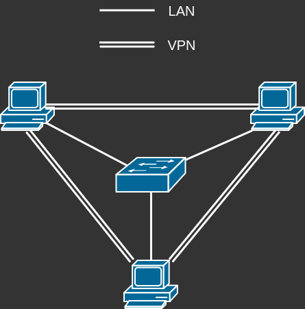

# Devops

## Wprowadzenie

Przygotowaliśmy kilka różnych zadań tematycznych z zakresu sekcji DevOps.
Opisy poszczególnych zadań znajdują się w [sekcji Zadania](#zadania) poniżej.
Wybierz tyle zadań, ile cię interesuje i je wykonaj - im więcej, tym lepiej, ale jakość wykonania i udokumentowania oraz ciekawe podejście do zadania też ma znaczenie!

**Powodzenia!**

### Oczekiwania

- Możesz nie być w pełni "ekspertem" w zakresie zadań, ale o ile znasz w pewnym stopniu Linuxa, to nie bój się ich podjąć!
  Zdobycie nowej wiedzy podczas wykonywania tych zadań jest odbierane pozytywanie, o ile poprawnie udokumentujesz ich przebieg.
- Zadania są tworzone z założeniem, że będą wykonywane na dowolnej standardowej dystrybucji Linuxa z dostępem administracyjnym.
  Wykonanie większości z nich powinno być możliwe z wykorzystaniem maszyny wirtualnej, a może również WSL.
  - Na serwerach kole wykorzystujemy dystrybucję Debian, przewodniczący sekcji osobiście korzysta z Archa.
- Z każdego z zadań utwórz sprawozdanie podobne do tych, które zazwyczaj wymagają prowadzący na laboratoriach, dokumentujące przebieg zadania.
  - Udokumentuj każdą czynność, krótko komentując w jakim celu to robisz, jaki efekt ma ta czynność, itp.
    Jeżeli świadomie podejmujesz jakąś decyzję, opisanie dlaczego podejmujesz taką, a nie inną decyzję jest mile widziane.
  - Nie musisz używać jakiegoś specjalnego formatowania (np. strony tytułowej) i uwzględniać wniosków, jeżeli nie chcesz.
    Twoje sprawozdanie powinno być czytelne, spójne i w pełni przedstawiać proces wykonywania przez ciebie zadania.
  - Jeżeli czegoś się nauczyłeś podczas wykonywania zadania, możesz o tym wspmnieć.
  - Możesz również umieścić linki do źródeł, z których korzystałeś, np. manpage, wiki dystrybucji (arch wiki <3), wątki na stack overflow lub reddit.
    Bezmyślne korzystanie z LLMów jest postrzegane negatywnie.
  - **Nie używaj LLMów do pisania sprawozdań - nawet do "formatowania tekstu"!**
  - Zalecany format sprawozdania: PDF lub Google Docs (udostępniony dokument tylko do odczytu).
- Rozszerzenie zadania o własne pomysły jest mile widziane!
- **Jeżeli uważasz, że w danym zadaniu brakuje kluczowych informacji, skontaktuj się z nami!**

## Zadania

Szybkie linki do poszczególnych zadań:

- [Deploy aplikacji webowej](#deploy-aplikacji-webowej)
- [VPN Wireguard](#vpn-wireguard)
- [Konfiguracja dostępów do maszyny wirtualnej](#konfiguracja-dostępów-do-maszyny-wirtualnej)

---

### Deploy aplikacji webowej

Twoim zadaniem jest postawić lokalnie backend + frontend ToPWR, wraz z serwisami wspierającymi - faktyczną aplikację tworzoną przez KN Solvro.

- Wybierz dowolny sposób na postawienie serwisów za pomocą kontenerów - od ręcznego wywoływania Dockera/Podmana, przez Docker Compose lub webowe panele adminstracyjne, aż do Kubernetes.
  - Nie zalecamy stawiania nowego klastra Kubernetes tylko po to, by wykonać to zadanie - jednak jeżeli masz już własny klaster, to śmiało z niego korzystaj!
- Do postawienia masz dwa główne serwisy: [backend](https://github.com/Solvro/backend-topwr) i [frontend](https://github.com/Solvro/web-topwr), wraz z serwisami wspierającymi. (baza danych, itp)
- **Upewnij się, że dane zapisane w serwisach nie zostaną utracone po usunięciu i utworzeniu ponownym kontenerów!**
- Serwisy powinny działać chociaż lokalnie i być dostępne poprzez standardową przeglądarkę bez podawania portu. HTTPS mile widziany.
  - Jeżeli masz publiczny adres IPv4 lub IPv6, albo serwer w chmurze, możesz serwisy wystawić publicznie.
    W takim przypadku przypisz serwis do odpowiednich domen.
    Jeżeli nie masz własnej domeny, napisz do nas - wydzielimy ci subdomenę w rekrutacja.solvro.pl.
  - Jeżeli nie masz publicznego adresu IP, "utwórz" własną domenę edytując plik `/etc/hosts`, lub użyj subdomen `localhost`. (tak, tak się da!)
    Dopuszczalne jest w takim przypadku używanie certyfikatów self-signed, odrzucanych domyślnie przez przeglądarki.
  - Jeżeli serwisy mogą być dostępne ciągle, całodobowo podczas rekrutacji, to utwórz również konto administracyjne dla sprawdzajacego sprawozdanie na adres `admin <małpa> <główna domena serwisów KN Solvro (nie pwr.edu.pl)>`
- Po postawieniu seriwsów zaprezentuj działanie panelu administracyjnego ToPWR, edytując/dodając/usuwając wpisy, zmieniając zdjęcia, itp.

#### Backend

- Repozytorium backendu ToPWR znajduje się pod adresem [https://github.com/Solvro/backend-topwr](https://github.com/Solvro/backend-topwr).
- Backend jest napisany w TypeScript, w frameworku [adonis](https://adonisjs.com/).
- W repozytorium znajduje się gotowy Dockerfile używany "na produkcji" oraz plik `.env.example` zawierający zmienne środowiskowe wymagane do uruchomienia serwisu.
- Zmienne środowiskowe można przekazać w standardowy sposób uruchamiając serwis, lub poprzez plik `.env`.
- Backend wymaga połączenia z bazą danych PostgreSQL.
- Serwis zapisuje wgrane pliki do lokalnego katalogu `storage`.
  **Upewnij się, że te dane nie zostaną utracone po usunięciu i ponownym utworzeniu kontenera!**
- Do niektórych funkcjonalności wymagane są również dane dostępowe do serwera pocztowego oraz Firebase.
  Nie musisz ich konfigurować, nie są one konieczne do wykonania tego zadania.
- Oprócz komend w pliku `package.json`, pomocne mogą się okazać również następujące komendy:
  - `node ace` - główna komenda administracyjna adonisa
  - `node ace migration:run` - uruchomienie migracji bazy danych - utworzenie tabel
  - `node ace db:scrape` - import danych z produkcyjnych serwerów ToPWR
  - `node ace create:user` - tworzenie nowego użytkownika, wybierz rolę `solvro_admin` przy tworzeniu
- Możesz użyć ścieżek `/` i `/api/v1/departments?logo=1` do sprawdzenia, czy serwis działa.

#### Frontend

- Repozytorium frontendu ToPWR znajduje się pod adresem [https://github.com/Solvro/web-topwr](https://github.com/Solvro/web-topwr).
- Repozytorium frontend nie posiada gotowego Dockerfile - jeżeli wybrany przez ciebie sposób deploy go wymaga, to musisz utworzyć go sam.
  - Frontend jest napisany w TypeScript, w frameworku [Next.js](https://nextjs.org/).
    Użyj dostępnych na internecie lub w repozytorium informacji, by utworzyć odpowiedni Dockerfile.
  - W dokumentacji Next.js możesz znaleźć również gotowy Dockerfile, którego możesz użyć bezpośrednio, lub zmodyfikować/zoptymalizować.
- Poprzez zmienne środowiskowe skieruj lokalną instancję frontendu na postawiony wcześniej backend.
- Sprawdź, czy serwis działa, czy da się zalogować, itd.

#### Opcjonalne zadania dodatkowe

- Dokonaj kopii zapasowej serwisów, wprowadź jakieś zmiany, wczytaj kopię zapasową, zweryfikuj poprawność wczytanych danych
- Backend na ścieżce `/metrics` wystawia metryki dla serwisu Prometheus - podepnij backend pod monitoring
  - Podepnij Prometheusa pod Grafanę, utwórz dashboard prezentujący wybrane metryki (np. ilość requestów)
  - Zdefiniuj alerty (np. na wysoki współczynnik odpowiedzi 5xx -> powiadomienie discord)
    - Przetestuj zdefiniowane alerty (np. zepsuj połączenie z bazą i próbuj czytać dane z bazy)
- Inne, własne pomysły?

**[Powrót do listy zadań](#zadania)**

---

### VPN Wireguard

W tym zadaniu utworzysz meshowego VPNa za pomocą Wireguarda - technologii wykorzystywanej na naszych serwerach.

Zadanie możesz wykonać na kilka sposobów:

- Jeżeli masz min. 3 urządzenia końcowe, podłączone do fizycznej sieci w sposób umożliwiajacy im wszystkim wzajemną komunikację w obie strony (bez NAT), to możesz to zadanie wykonać na fizycznym sprzęcie.
  - Najlepiej gdyby były to komputery stacjonarne lub laptopy, w teorii można również wykorzystać telefon z androidem i aplikacją termux?
- Możesz również utworzyć wirtualną sieć, do której podłączysz minimum 3 maszyny wirtualne.
  - Wystarczy najprostza dystrybucja linuxa, nawet z instalatora Archa raczej uda się wykonać zadanie - byleby można było zainstalować narzędzia do konfiguracji wireguard.
- Możliwe, że da się w identyczny sposób użyć 3 kontenerów dockerowych w trybie uprzywilejowanym - nie testowane.
- Można również zejść poziom niżej - ręcznie za pomocą komend `ip` utworzyć 3 namespace sieciowe (netns), 1 bridge w głównym netns, do każdego utworzonego netns dodać wirtualny przewód ethernet (veth) podłączony do bridge w głównym netns, a na konieć ustawić adresację.
  - łatwo się pogubić który netns to który, ale ten sposób pozwala zwizualizować jak docker tworzy sieci wirtualne (bo robi to identycznie, tylko że automatycznie)

W każdym wypadku topologia sieci powinna wyglądać mniej-więcej następująco:

#### Zestawianie sieci

- Wybierz dowolną podsieć z zakresu adresacji prywatnej IPv4 i/lub IPv6
- Utwórz konfiguracje Wireguard dla każdego z urządzeń, które przyłączasz do sieci (min. 3 urządzenia).
  - Zalecamy format `wg-quick`, inne są również akceptowalne (`systemd-networkd`, `NetworkManager`, etc... ręczna konfiguracja przez `ip` i `wg`???)
  - Utworzone przez ciebie konfiguracje powinny stworzyć sieć typu mesh
- Uruchom konfiguracje i sprawdź, czy urządzenia mogą się ze sobą komunikować poprzez VPN.
  - Udowodnij, że urzadzenia faktycznie komunikują się przez VPN, a nie sieć lokalną.

#### Firewall

- Na wybranym hostcie uruchom dowolną usługę, nasłuchując na wszystkich adresach IP
  - Może to być SSH, HTTP, albo nawet netcat w trybie nasłuchu TCP lub UDP
- Z innego hosta połącz się z usługą zarówno poprzez sieć LAN jak i VPN
- Na hostcie z usługą dodaj zasadę do firewalla odrzucającej pakiety kierowane do usługi spoza VPN
  - sugerowany firewall: iptables
- Ponownie spróbuj połączyć się z innego hosta z usługą zarówno poprzez LAN jak i VPN

#### Routing przez VPN

- Wybierz kolejną, dowolną podsieć z zakresu adresacji prywatnej IPv4 i/lub IPv6
- Ustaw wybranego hosta w tryb routera i utwórz tą podsieć, gdzie spośród dotychczasowych urządzeń tylko ten host jest do niej podłączony
  - Najprostszy spobób: dodaj adres do interfejsu `lo`, alternatywa: utwórz nowy interfejs typu `bridge`.
  - **Nie dodawaj tej sieci jako adres interfejsu wireguard!**
- Zmodyfikuj konfigurację VPN hostów tak, by mogły się skomunikować z adresami nowej podsieci.
- Udowodnij, że ruch sieciowy z innych hostów do podsieci jest przesyłany przez VPN.

#### Opcjonalne zadania dodatkowe

- Spróbuj skonfigurować tunel tak, by system kierował przez niego również pakiety skierowane do adresów "publicznych" (nie-VPNowych) uczestników
  - Wystarczy, że skonfigurujesz tak tylko jedno urządzenie, choć w niektórych przypadkach będzie to oznaczało, że pozostałe urządzenia będą kierowały odpowiedzi przez sieć lokalną
  - Udowodnij, że to urządzenie faktycznie wysyła żądania na adresy "publiczne" skonfigurowaych uczestników przez VPN, nie wpadając w pętlę routingu
- Inne, własne pomysły?

**[Powrót do listy zadań](#zadania)**

---

### Konfiguracja dostępów do maszyny wirtualnej

Twoim zadaniem będzie skonfigurować różne formy dostępu do maszyny wirtualnej.

Do tego zadania będziesz potrzebował lokalnej maszyny wirtualnej z dowolną standardową dystrybucją Linuxa.
Nie musisz opisywać procesu instalacji w sprawozdaniu.
Dla użytkowników Linuxa zalecamy wirtualizatory bazujące na QEMU/KVM i libvirt - w szczególności virt-manager.

#### SSH

##### Podstawowa konfiguracja

- Zainstaluj serwer SSH, jeżeli nie został domyślnie zainstalowany
- Utwórz nowego użytkownika, przypisz mu uprawnienia sudo, doas, lub innego systemu eskalacji uprawnień wykorzystywanego na wybranej dystrybucji
- Skonfiguruj autentykację nowego użytkownika za pomocą kryptografii asymetrycznej
- Zaprezentuj działanie skonfigurowanej autentykacji logując się na utworzonego użytkownika

##### "Niestandardowe" ustawienia

- Dokonuj zmian w konfiguracji SSH w taki sposób, by nie była wymagana interwencja podczas aktualizacji serwera SSH w razie konfliktów z domyślną konfiguracją
- Skonfiguruj serwer SSH tak, by różne "funkcjonalności" serwera wymagały przypisania odpowiednich grup użytkownikowi, na przykład:
  - grupa wymagana, by móc się zalogować przez SSH
  - grupa zezwalająca logować się hasłem z wybranych adresów IP
  - grupa zezwalająca logować się hasłem z dowolnego adresu IP
  - grupa zezwalająca korzystać z przekazywania portów
  - grupa zezwalająca przekazać port na serwer, ustawiając go w tryb nasłuchu na wszystkich adresach
  - grupa zezwalająca korzystać z przekazywania X11
  - ...itd.
- Sprawdź jakie algorytmy kryptograficzne oferuje serwer SSH i wyłącz te przestarzałe
- Ustaw niestandardowy port SSH
- Skonfiguruj blokowanie problematycznych adresów IP (niepotrafiących się poprawnie uwierzytelnić) według własnego uznania (opcja dodana w OpenSSH 9.7)
  - Dodaj odpowiedni zakres adresów IP do listy "zaufanych"

#### Sudo

- Utwórz kolejnego użytkownika, skonfiguruj sudo/doas tak, by mógł on wykonywać tylko jedną, wybraną komendę jako root (np. shutdown)
- Zezwól temu użytkownikowi wykonywanie innej komendy, jako inny użytkownik, bez podawania hasła
- Zaprezentuj dokonane zmiany w akcji

#### Alternatywne sposoby dostępu

- Jeżeli twój wirtualizator to wspiera, dodaj do maszyny wirtualnej port seryjny i skonfiguruj system tak, by wyświetlał na tym porcie konsolę
- Jeżeli twój wirtualizator to wspiera, dołącz maszynę do sieci VSOCK
  - Skonfiguruj serwer SSH, by nasłuchiwał na sieci VSOCK (protip: systemd)
  - Tymczasowo odłącz maszynę wirtualną od standardowej sieci Ethernet i połącz się z nią przez SSH poprzez sieć VSOCK
- Skonfiguruj wybrany webowy panel administracyjny
  - Nasza sugestia: cockpit
  - Zaprezentuj jego działanie i możliwości

#### Opcjonalne zadania dodatkowe

- Znasz inne alternatywne sposoby dostępu do maszyn wirtualnych? Zaprezentuj je.
- Inne, własne pomysły na ciekawą konfigurację uwierzytelnienia?

**[Powrót do listy zadań](#zadania)**
